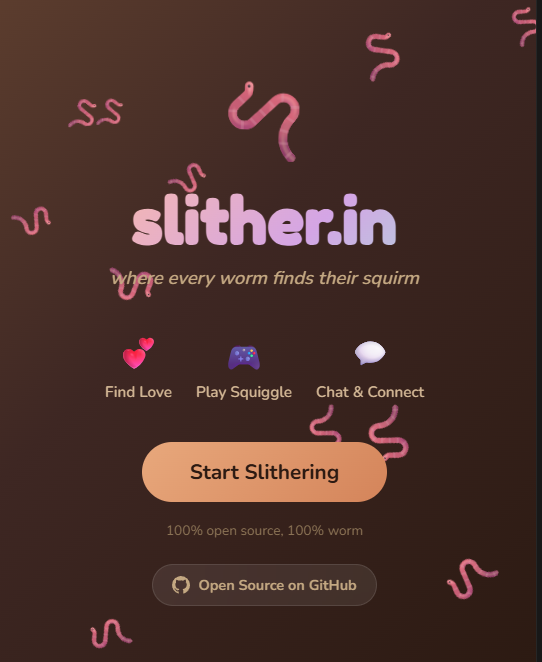

# slither.in

Welcome to **slither.in**, the premier (and only) dating experience for worms who are emotionally available, moisture-compatible, and brave enough to cross the sidewalk.

If you’ve ever looked at a worm and thought “that lil noodle deserves love,” you’re home.

## Visit the Terrarium

- **Live site**: `https://slitherin.vercel.app/`  
- **Open-source burrow**: `https://github.com/Caerii/slither.in`



## What’s inside this compost heap?

- **Discover**: swipe left/right on deeply eligible annelids
- **Chat**: tap dialogue buttons or hit **Wriggle!** (no typing, only vibes)
- **Squiggle**: snack-chase arcade chaos (boots, robins, combos, glory)

## Where the app lives (the main burrow)

The actual Vite app is in the `slither.in/` directory.

```bash
cd slither.in
pnpm install
pnpm run dev
```

Then open `http://localhost:3000` and begin courtship.

## Deploy (Vercel, aka “release the worms into the wild”)

Set Vercel **Root Directory** to `slither.in`, then build normally (`pnpm run build`) with output `dist`.

## Serious disclaimer (not that serious)

- No worms were harmed in the making of this app.
- Some worms *were* emotionally devastated by being **passed**.
- If you are a bird reading this: please leave.

